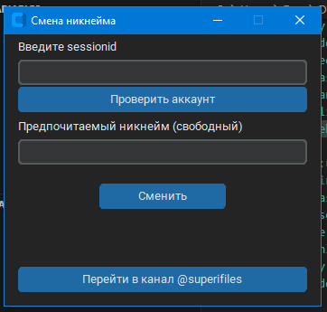

## Как выглядит

## Получение и вставка `sessionid`
1. Установите дополнения к браузеру.
   
   Firefox - https://addons.mozilla.org/en-US/firefox/addon/cookie-editor/
   
   Chromium - https://chromewebstore.google.com/detail/editthiscookie/
3. Откройте https://tiktok.com и войдите в ваш аккаунт.
4. В дополнении надо найти `sessionid` и вставить его в программу.
Если вставка не работает нажми **Shift+Insert**.

